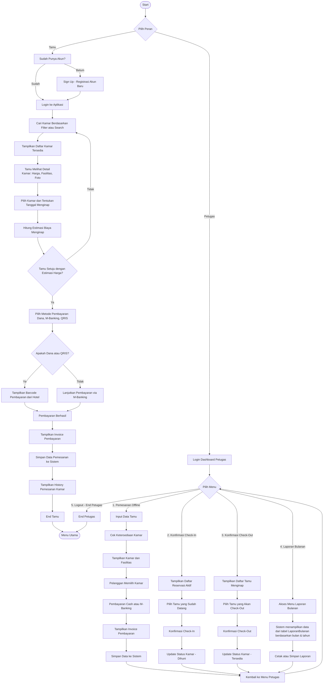

# ikuae
# ERD

# Flowchart

```mermaid
flowchart TD
    %% ===== START =====
    A([Start]) --> B{Pilih Peran}
    B -->|Tamu| U1[Sudah Punya Akun?]
    B -->|Petugas| A1[Login Dashboard Petugas]

    %% ===== ALUR Tamu =====
    U1 -->|Belum| U2[Sign Up - Registrasi Akun Baru]
    U1 -->|Sudah| U3[Login ke Aplikasi]
    U2 --> U3
    U3 --> U4[Cari Kamar Berdasarkan Filter atau Search]
    U4 --> U5[Tampilkan Daftar Kamar Tersedia]
    U5 --> U6[Tamu Melihat Detail Kamar: Harga, Fasilitas, Foto]
    U6 --> U7[Pilih Kamar dan Tentukan Tanggal Menginap]
    U7 --> U8[Hitung Estimasi Biaya Menginap]
    U8 --> U9{Tamu Setuju dengan Estimasi Harga?}
    U9 -->|Ya| U10[Pilih Metode Pembayaran: Dana, M-Banking, QRIS]
    U9 -->|Tidak| U4
    U10 --> U11{Apakah Dana atau QRIS?}
    U11 -->|Ya| U12[Tampilkan Barcode Pembayaran dari Hotel]
    U11 -->|Tidak| U13[Lanjutkan Pembayaran via M-Banking]
    U12 --> U14[Pembayaran Berhasil]
    U13 --> U14
    U14 --> U15[Tampilkan Invoice Pembayaran]
    U15 --> U16[Simpan Data Pemesanan ke Sistem]
    U16 --> U17[Tampilkan History Pemesanan Kamar]
    U17 --> U18[End Tamu]
    U18 --> M([Menu Utama])

    %% ===== ALUR PETUGAS =====
    A1 --> A2{Pilih Menu}
    A2 -->|1. Pemesanan Offline| A3[Input Data Tamu]
    A2 -->|2. Konfirmasi Check-In| A10[Tampilkan Daftar Reservasi Aktif]
    A2 -->|3. Konfirmasi Check-Out| A17[Tampilkan Daftar Tamu Menginap]
    A2 -->|4. Laporan Bulanan| A23[Akses Menu Laporan Bulanan]
    A2 -->|5. Logout - End Petugas| A27[End Petugas]

    %% --- PEMESANAN OFFLINE ---
    A3 --> A4[Cek Ketersediaan Kamar]
    A4 --> A5[Tampilkan Kamar dan Fasilitas]
    A5 --> A6[Pelanggan Memilih Kamar]
    A6 --> A7[Pembayaran Cash atau M-Banking]
    A7 --> A8[Tampilkan Invoice Pembayaran]
    A8 --> A9[Simpan Data ke Sistem]
    A9 --> A26[Kembali ke Menu Petugas]

    %% --- KONFIRMASI CHECK-IN ---
    A10 --> A11[Pilih Tamu yang Sudah Datang]
    A11 --> A12[Konfirmasi Check-In]
    A12 --> A13[Update Status Kamar - Dihuni]
    A13 --> A26

    %% --- KONFIRMASI CHECK-OUT ---
    A17 --> A18[Pilih Tamu yang Akan Check-Out]
    A18 --> A19[Konfirmasi Check-Out]
    A19 --> A20[Update Status Kamar - Tersedia]
    A20 --> A26

    %% --- LAPORAN BULANAN ---
    A23 --> A24[Sistem menampilkan data dari tabel LaporanBulanan berdasarkan bulan & tahun ]
    A24 --> A25[Cetak atau Simpan Laporan]
    A25 --> A26[Kembali ke Menu Petugas]

    %% --- AKHIR ADMIN DAN MENU UTAMA ---
    A26 --> A2
    A27 --> M
```
# CDM

# PDM
[hotel_PDM.pdb](https://github.com/user-attachments/files/23394719/hotel_PDM.pdb)

