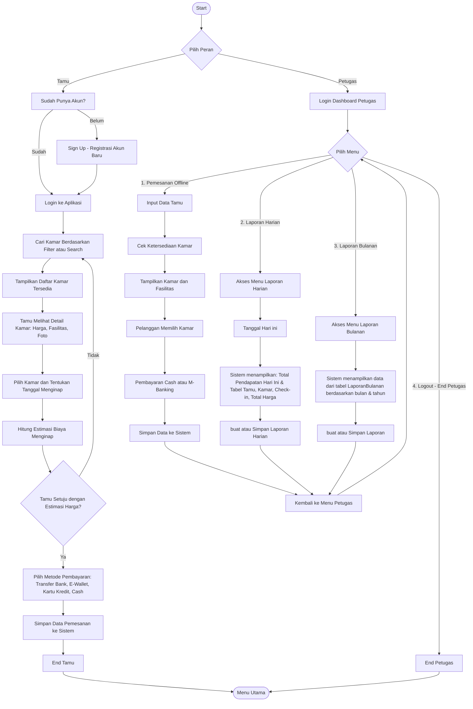

# Hotel Reservation Website

## Running the code

Run `npm i` to install the dependencies.

Run `npm run dev` to start the development server.

# Flowchart

# ERD

# CDM

# PDM

# cara mengirim db ke db orecle

1. "cd backend-pbl"
2. npm init -y
3.  npm install oracledb express
4. node index.js
5. npm install dotenv
6. node index.js
## cara menjalankan server 

[running.md](./Backend/running.md)
